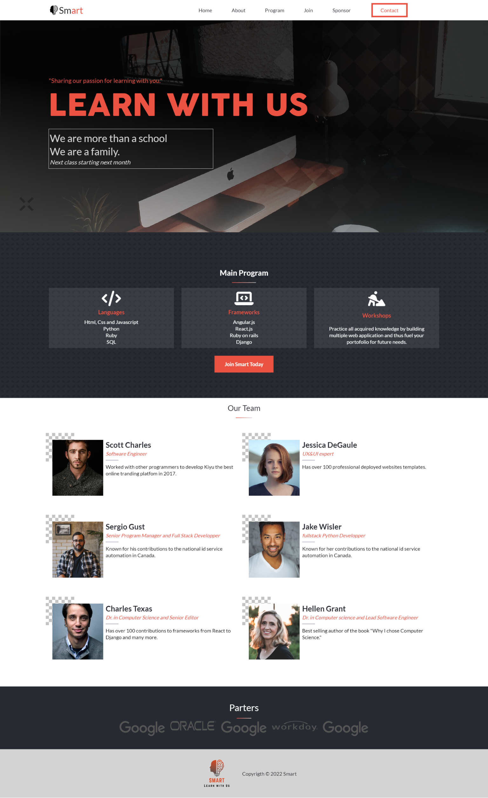
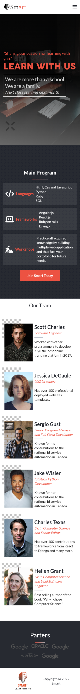

# Project Name: Smart Online Coding School

>**Smart is a platform that provides student from all around the world an opportunity to learn coding without having to worry distance, Fees and other hinders that can easily be found in tradition school systems.(This is A capstone project done at Microverse).**

## Built With

- HTML and CSS
- Javascript
- npm(Node.js)
- Font-awesome
- SASS Preprocessor( SCSS )

## Live Demo

[**See Project 🚀**](https://davezag.github.io/Smart-Online-school-capstone-project/)

## Screenshots

 

  

## Getting Started

To get a local copy up and running follow these simple example steps.

### Prerequisites

- To have basic understanding of the web, and web technologies like HTML, CSS and Javascript.
- Web browser: Chrome (Prefered one).

### Setup

- Here is a command to clone this project

  `git clone https://github.com/DaveZag/Smart-Online-school-capstone-project.git`

Once clone on your computer, open the folder then open the index.html file in your browser. If you opened the folder in vscode or another Code Editor, look for the extesion __"live server"__; install it then click on Go Live at the bottom right of you vscode editor and voila.

## Author

👤 **Dave ZAGABE**

## Repo Links

- Repository: [Smart](https://github.com/DaveZag/Smart-Online-school-capstone-project)

## Socials

>- GitHub: [@Dave Zag](https://github.com/DaveZag)
>- Twitter: [@Dave Zagabe](https://twitter.com/davezagabe2)
>- LinkedIn: [@Dave Zagabe](https://www.linkedin.com/in/dave-zagabe-03597a247/)

## 🤝 Contributing

Contributions, issues, and feature requests are welcome!

Feel free to check the [issues page](../../issues/).

## Show your support

Give a ⭐️ if you like this project!

## Acknowledgments

- [Microverse](https://github.com/microverseinc)

## Credit
- All credits to
<a href="https://www.behance.net/adagio07" rel="noopener" target="_blank"><strong>Cindy Shin</strong></a>  for creating the template from which I took inspiration.This project is a mockup of Cindy's design template.
- The images used in this project are from [Pexels](https://www.pexels.com/collections/computers-hoxyyjd/) and [Unsplash](https://unsplash.com/s/photos/random-people).

## 📝 License

This project is [MIT](./LICENSE) licensed.
